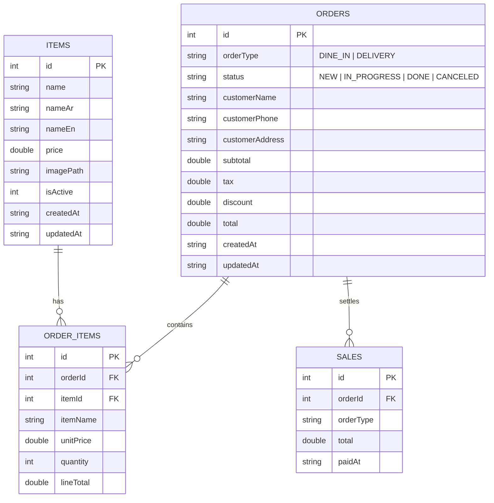

# Mazaq POS (Offline Restaurant System)

> Flutter-based Restaurant POS يعمل بالكامل Offline عبر شبكة محلية (Local Router) بدون إنترنت، مع دعم الطباعة، CRUD، الطلبات، الإحصائيات، والتصدير.

---

## الأهداف الرئيسية

- Offline-first بدون أي اعتماد على سيرفر خارجي.
- تجربة كاشير سريعة وواضحة بأزرار كبيرة وخيارات قليلة لكل خطوة.
- فصل معماري Clean Architecture مع Repository Pattern.
- تعدد لغات (AR/EN) عبر `intl` وملفات ترجمة JSON فقط.
- عدم استخدام Hard Code للنصوص أو المقاسات أو الألوان.

---

## Architecture (Clean Architecture)

```
Presentation (UI)
  ├─ Screens
  ├─ Widgets
  └─ Providers (State Management)

Domain
  ├─ Entities
  ├─ UseCases
  └─ Repositories (Abstract)

Data
  ├─ Models (DTO)
  ├─ Local Data Sources (SQLite)
  └─ Repositories (Implementations)
```

### Layer Rules

- Presentation يعتمد فقط على Domain.
- Domain مستقل ولا يعتمد على أي Layer أخرى.
- Data يعتمد على Domain فقط لتنفيذ Repositories.

---

## ERD (Database Design)

> SQLite محلي فقط، مع فهارس لتسريع البحث والفلترة.



---

## Project Structure

```
lib/
  core/
    config/
    constants/
    errors/
    helpers/
    localization/
    theme/
    utils/
  data/
    datasources/
      local/
    models/
    repositories/
  domain/
    entities/
    repositories/
    usecases/
  presentation/
    providers/
    screens/
    widgets/
  main.dart
assets/
  i18n/
    ar.json
    en.json
  images/
```

---

## Best Practices

- استخدم `flutter_screenutil` لكل الأبعاد والخطوط.
- النصوص من ملفات ترجمة JSON فقط عبر `intl`.
- لا توجد قيم ثابتة للألوان أو الأبعاد داخل الـ UI؛ كلها من `theme` و `constants`.
- Repository Pattern لكل العمليات على SQLite.
- UseCases صغيرة ومحددة الوظيفة.
- Providers خفيفة لتمرير الحالة فقط، والمنطق في UseCases.

---

## State Management (Provider)

- `MenuProvider`: إدارة الأصناف والفلترة.
- `OrderProvider`: إنشاء الطلب وتحديثه.
- `SalesProvider`: التقارير والإحصائيات.
- `LocaleProvider`: تغيير اللغة.

---

## Printing Architecture

- الطباعة عبر:
  - USB
  - WiFi Printer 1 (TCP/IP)
  - WiFi Printer 2 (TCP/IP)
- الطباعة Output: Image أو PDF فقط لدعم العربية.
- Printer Service موحد يدعم اختيار المسار حسب نوع الطابعة.

---

## Core Code Examples

### Domain Entity

```dart
class MenuItemEntity {
  final int id;
  final String nameAr;
  final String nameEn;
  final double price;
  final String? imagePath;
  final bool isActive;

  const MenuItemEntity({
    required this.id,
    required this.nameAr,
    required this.nameEn,
    required this.price,
    this.imagePath,
    required this.isActive,
  });
}
```

### Repository (Domain)

```dart
abstract class MenuRepository {
  Future<List<MenuItemEntity>> getAllItems();
  Future<void> addItem(MenuItemEntity item);
  Future<void> updateItem(MenuItemEntity item);
  Future<void> deleteItem(int id);
}
```

### UseCase

```dart
class GetAllMenuItemsUseCase {
  final MenuRepository repository;

  GetAllMenuItemsUseCase(this.repository);

  Future<List<MenuItemEntity>> call() {
    return repository.getAllItems();
  }
}
```

### Provider

```dart
class MenuProvider extends ChangeNotifier {
  final GetAllMenuItemsUseCase getAllItems;
  final AddMenuItemUseCase addItem;

  MenuProvider({
    required this.getAllItems,
    required this.addItem,
  });

  List<MenuItemEntity> _items = [];
  List<MenuItemEntity> get items => _items;

  Future<void> loadItems() async {
    _items = await getAllItems();
    notifyListeners();
  }
}
```

### Localization Helper

```dart
class AppLocalizations {
  final Map<String, dynamic> _localizedValues;

  AppLocalizations(this._localizedValues);

  String tr(String key) {
    return _localizedValues[key] ?? key;
  }
}
```

---

## UI/UX Guidelines (Restaurant-focused)

- **لوحة رئيسية واضحة**: تبويبات سريعة (Menu / Orders / Sales).
- **تصميم مقسم**: القائمة يسار، الطلب الحالي يمين.
- **أزرار كبيرة**: الطلب، الطباعة، التعديل، الإلغاء.
- **ألوان مريحة**: درجات دافئة مع تباين واضح للنص.
- **تقليل الأخطاء**: تأكيد قبل الحذف، والتنبيه عند الطباعة.
- **إجراءات سريعة**: Shortcuts للكاشير (أيقونات واضحة).

---

## Export Data

- دعم تصدير جداول:
  - Items
  - Orders
  - Sales
- الصيغ: CSV و JSON.
- التصدير يعمل محليًا بالكامل بدون سيرفر.

---

## Next Steps

1) تجهيز قاعدة البيانات SQLite مع الجداول.
2) بناء الـ Repositories وUseCases.
3) تصميم الشاشات الأساسية.
4) دمج الطباعة عبر USB وTCP/IP.
5) إضافة التصدير والتقارير.

---

## Implemented (Phase 1)

- **Database & Data Layer**: SQLite setup with repositories and data sources.
- **UseCases & Providers**: Menu, Orders, Sales, Export (Provider).
- **Localization**: JSON translations with `intl` and no hard-coded UI text.
- **UI Core**: Home navigation + Menu + Orders + Sales + Item CRUD form.
- **Screen Scaling**: `flutter_screenutil` for dimensions.
- **Export Service**: Local CSV/JSON export for Items/Orders/Sales.
- **Printing Stub**: PDF/Image-ready builder with localized labels.

### Key Files

- [lib/data/datasources/local/app_database.dart](lib/data/datasources/local/app_database.dart)
- [lib/domain/usecases](lib/domain/usecases)
- [lib/presentation/screens/home/home_screen.dart](lib/presentation/screens/home/home_screen.dart)
- [lib/presentation/screens/menu/menu_screen.dart](lib/presentation/screens/menu/menu_screen.dart)
- [lib/presentation/screens/items/item_form_screen.dart](lib/presentation/screens/items/item_form_screen.dart)
- [lib/data/datasources/local/export_local_data_source.dart](lib/data/datasources/local/export_local_data_source.dart)
- [lib/core/printing/print_job_builder.dart](lib/core/printing/print_job_builder.dart)
- [assets/i18n/en.json](assets/i18n/en.json)
- [assets/i18n/ar.json](assets/i18n/ar.json)

---

## Run

```bash
flutter pub get
flutter run
```

---

## License

هذا المشروع مخصص للاستخدام الداخلي لمطاعم POS Offline.
